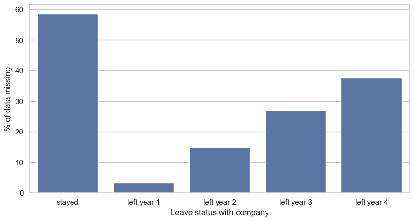
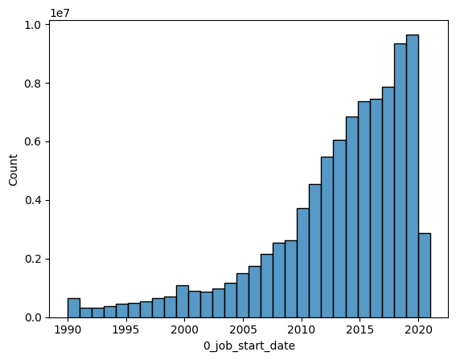

# Elementary Data Analysis

Due to computational limits and privacy concerns only the most relevant insights for modeling are explored and shown.

## Overview statistics

The missing data rate ranges between 0% and up to 81% with only four features having no missing data and 45 features having less than 50% missing data rate.
Education features are especially likely to possess missing values. Additionally, job end dates are significantly more likely to be empty compared to job start dates.

| Length in characters | maximum | mean | median |
|----------------------|---------|------|--------|
| 0_summary            | 3184    | 186  | 60     |
| 3_skills             | 9398    | 243  | 200    |
| 4_interests          | 5955    | 105  | 66     |
| 5_certifications     | 31354   | 106  | 59     |

### Label statistics

As expected by the construction of the labels, the labels show a significant Imbalance.

Total entries: 91199031

Total entries stayed: 68386482 (75%)

Total entries left year 1: 1972179 (2.2%)

Total entries left year 2: 9415405 (10%)

Total entries left in year 3: 16697463 (18%)

Total entries left in year 4: 22812699 (25%)

Additionally, Levene's test shows the variance across labels is unequal.

## Independent variables

### Missing data by group

Staying with the company for the past period is associated, on average, with a higher percentage of missing data in the LinkedIn profile.
This could indicate that the absence of data could contain relevant information.

***
Bar chart showing the average percent of missing data by group 
***

## Literature context of potential features

[de Jesus, A. C. C., Júnior, M. E. G., & Brandão, W. C. (2018, April)](https://doi.org/10.1145/3167132.3167320) found success in predicting a binary likely/unlikely to leave
using categorical features: locations (city and state)
current and previous work position and numerical proxies: skills, university degrees, time spent in university, languages, connections, and work experiences.

[Raza, A., Munir, K., Almutairi, M., Younas, F., & Fareed, M. M. S. (2022).](https://doi.org/10.3390/app12136424) found job level to be a key factor for employees to leave
when predicting employee attrition.

[Alduayj, S. S., & Rajpoot, K. (2018, November)](https://doi.org/10.1109/INNOVATIONS.2018.8605976) also found job level and job role as significant predictors for
employees leaving their current employer.

[Fallucchi, F., Coladangelo, M., Giuliano, R., & William De Luca, E. (2020)](https://doi.org/10.3390/computers9040086) found of the present features only total years worked to be
predictive for employees quitting. [Al-Darraji, S., Honi, D. G., Fallucchi, F., Abdulsada, A. I., Giuliano, R., & Abdulmalik, H. A. (2021)](https://doi.org/10.3390/computers10110141)
found on the same dataset job level, years at current company, years in current position and total years worked to be predictive.

[Guerranti, F., & Dimitri, G. M. (2022)](https://doi.org/10.3390/app13010267) predicted employee attrition using categorical features: Education field, job level, job role, department\
and numerical proxies for Education, previous work experience (Number of previous companies), years at the company, years at the current role and total working years.

None of the surveyed articles uses unstructured text as part of their feature set. All articles encountered imbalanced datasets.
Furthermore, the largest dataset presented around 120.000 profiles before data cleaning. No author framed the problem as a multi-label problem.

### Categorical feature analysis

For selected categorical features test summaries are provided as motivation to seperatedly encode features during modeling.
For all variables with degrees of freedom (dof) > 5 Cohen's omega should be used to assess effect strength. Cohen's omega is provided for pearson.

All tests are in reference to leaving in year 4, i.e. someone is willing to leave the company within the next 4 years.

#### Datablock 0: industry

Cohen's omega: 1.57

| test               | lambda | chi2        | dof   | pval | cramer | power |
|--------------------|--------|-------------|-------|------|--------|-------|
| pearson            | 1.000  | 1556628.244 | 146.0 | 0.0  | 0.131  | 1.0   |
| cressie-read       | 0.667  | 1560073.049 | 146.0 | 0.0  | 0.131  | 1.0   |
| log-likelihood     | 0.000  | 1577564.777 | 146.0 | 0.0  | 0.132  | 1.0   |
| freeman-tukey      | -0.500 | 1601117.746 | 146.0 | 0.0  | 0.133  | 1.0   |
| mod-log-likelihood | -1.000 | 1635187.408 | 146.0 | 0.0  | 0.134  | 1.0   |
| neyman             | -2.000 | 1743873.707 | 146.0 | 0.0  | 0.138  | 1.0   |

#### Datablock 0: inferred_salary

Cohen's omega: 0.21

| test               | lambda | chi2       | dof  | pval | cramer | power |
|--------------------|--------|------------|------|------|--------|-------|
| pearson            | 1.000  | 451161.612 | 10.0 | 0.0  | 0.070  | 1.0   |
| cressie-read       | 0.667  | 455439.341 | 10.0 | 0.0  | 0.071  | 1.0   |
| log-likelihood     | 0.000  | 464931.070 | 10.0 | 0.0  | 0.071  | 1.0   |
| freeman-tukey      | -0.500 | 472924.575 | 10.0 | 0.0  | 0.072  | 1.0   |
| mod-log-likelihood | -1.000 | 481725.875 | 10.0 | 0.0  | 0.073  | 1.0   |
| neyman             | -2.000 | 501988.817 | 10.0 | 0.0  | 0.074  | 1.0   |

#### Datablock 0: job_company_industry

Cohen's omega: 1.08

| test               | lambda | chi2       | dof   | pval | cramer | power |
|--------------------|--------|------------|-------|------|--------|-------|
| pearson            | 1.000  | 747006.029 | 146.0 | 0.0  | 0.091  | 1.0   |
| cressie-read       | 0.667  | 743881.966 | 146.0 | 0.0  | 0.090  | 1.0   |
| log-likelihood     | 0.000  | 741374.858 | 146.0 | 0.0  | 0.090  | 1.0   |
| freeman-tukey      | -0.500 | 742861.820 | 146.0 | 0.0  | 0.090  | 1.0   |
| mod-log-likelihood | -1.000 | 747407.499 | 146.0 | 0.0  | 0.091  | 1.0   |
| neyman             | -2.000 | 766795.273 | 146.0 | 0.0  | 0.092  | 1.0   |

#### Datablock 0: job_company_size

Cohen's omega: 0.14

| test               | lambda | chi2       | dof | pval | cramer | power |
|--------------------|--------|------------|-----|------|--------|-------|
| pearson            | 1.000  | 302721.229 | 7.0 | 0.0  | 0.058  | 1.0   |
| cressie-read       | 0.667  | 302554.770 | 7.0 | 0.0  | 0.058  | 1.0   |
| log-likelihood     | 0.000  | 302440.078 | 7.0 | 0.0  | 0.058  | 1.0   |
| freeman-tukey      | -0.500 | 302544.719 | 7.0 | 0.0  | 0.058  | 1.0   |
| mod-log-likelihood | -1.000 | 302812.835 | 7.0 | 0.0  | 0.058  | 1.0   |
| neyman             | -2.000 | 303841.223 | 7.0 | 0.0  | 0.058  | 1.0   |

#### Datablock 0: job_title_role

Cohen's omega: 0.23

| test               | lambda | chi2       | dof  | pval | cramer | power |
|--------------------|--------|------------|------|------|--------|-------|
| pearson            | 1.000  | 372853.194 | 14.0 | 0.0  | 0.064  | 1.0   |
| cressie-read       | 0.667  | 375867.019 | 14.0 | 0.0  | 0.064  | 1.0   |
| log-likelihood     | 0.000  | 383142.763 | 14.0 | 0.0  | 0.065  | 1.0   |
| freeman-tukey      | -0.500 | 389765.052 | 14.0 | 0.0  | 0.065  | 1.0   |
| mod-log-likelihood | -1.000 | 397467.383 | 14.0 | 0.0  | 0.066  | 1.0   |
| neyman             | -2.000 | 416464.855 | 14.0 | 0.0  | 0.068  | 1.0   |

#### Datablock 0: job_start_date

Cohen's omega: 4.55

| test               | lambda | chi2         | dof  | pval | cramer | power |
|--------------------|--------|--------------|------|------|--------|-------|
| pearson            | 1.000  | 6.297557e+07 | 31.0 | 0.0  | 0.831  | 1.0   |
| cressie-read       | 0.667  | 6.235717e+07 | 31.0 | 0.0  | 0.827  | 1.0   |
| log-likelihood     | 0.000  | 7.041607e+07 | 31.0 | 0.0  | 0.879  | 1.0   |
| freeman-tukey      | -0.500 | NaN          | 31.0 | NaN  | NaN    | NaN   |
| mod-log-likelihood | -1.000 | inf          | 31.0 | 0.0  | inf    | NaN   |
| neyman             | -2.000 | NaN          | 31.0 | NaN  | NaN    | NaN   |

Shapiro-Wilk test rejects the null thus the two groups are not normal however due to the large sample size >5000 the calculated p-value could be unreliable.
***
Histogram showing Datablock 0: job_start_date with bins = 30
***

