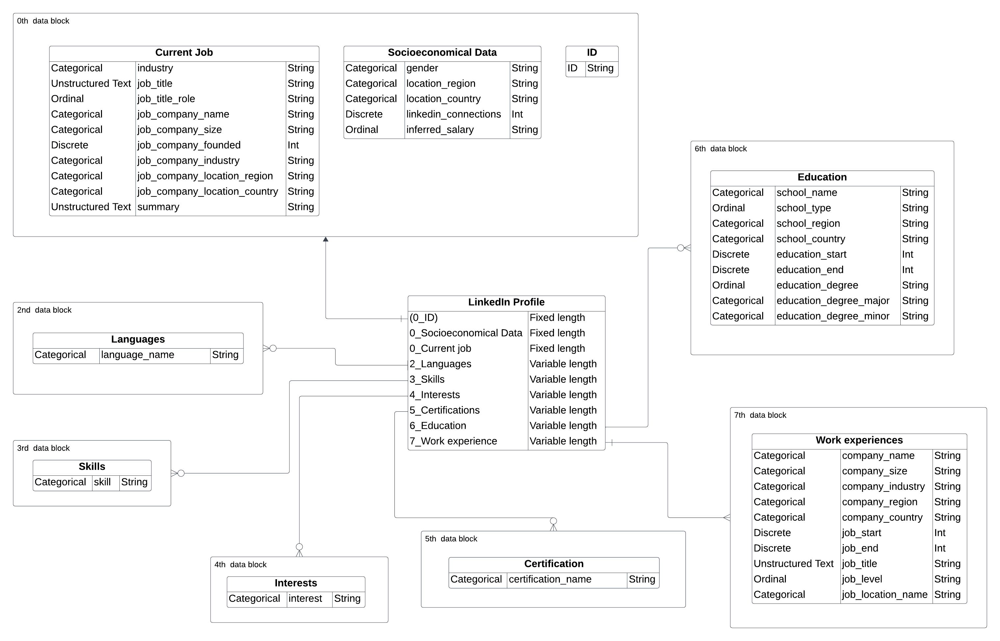

## Data collected

The initial dataset totals just over 450 million publicly accessible LinkedIn profiles as a union of existing and proprietary scrapes. 
Due to the nature of the data only outdated data will be used retaining the status of the profiles from 2021.
In total 7 blocks of data are collected per profile representing predictive features. 
All data blocks of fixed length are bundled in block zero while all data blocks with variable length are indicated by their individual '#_' prefix.
***
data schema
***

Data blocks three, four and five  are flattened by concatenating all values for each block to a string separated by `,`. Data blocks six and seven are flattened by appending a `_#` suffix
to each variable.

## Input values

`0_gender` can take on one of three values (`NaN`, `male`, `female`).

`0_inferred_salary` can take on one of 12 values (`NaN`, `<20,000`, `20,000-25,000`, `25,000-35,000`, `35,000-45,000`, `45,000-55,000`, `55,000-70,000`, `70,000-85,000`, `85,000-10,0000`, `100,000-150,000`, `150,000-250,000`, `>250,000`).

All `job_company_size` variables can take on one of nine values (`NaN`, `1-10`, `11-50`, `51-200`, `201-500`, `501-1000`, `1001-5000`, `5001-10000`, `10001+`).

`6_school_type` can take on one of four values (`NaN`, `primary school`, `secondary school`, `post-secondary institution`).

`7_job_level` can take on one of 11 values (`NaN`, `unpaid`, `training`, `entry`, `senior`, `manager`, `director`, `vp`, `cxo`, `owner`).

All `country` variables include all 193 countries plus all overseas territories. All country values can be found [here](./categories). 

All `industry` (and `job_industry`) variables include 147 industries [here](./categories). 

All `start`, `end`, `date` and `founded`  variables contain only the year.

All other variables are unstructured text supplied by the user.

## Data cleaning

All profiles without a currently listed occupation (`0_job_company_name` is empty) or which do not have a valid start date
for their current occupation (`0_job_start_date` is either empty or not between 1990 and 2021) are removed. 
Additionally, near-zero variance features are also removed.

All `language` features are dropped after the third feature. All `education` features are dropped after the fourth entry.
Lastly, all `company` features are dropped after the ninth feature. 

The resulting dataset consists of 91199031 profiles with 153 features each. 

## Missing data and data imputation

The missing data is missing completely at random (MCAR).

### Rational for imputing data

The author supposes that the process of getting ready to leave a company is contingent on trigger events and unfolds over time.
It appears resonable to assume such a trigger could be getting approached by a recruiter offering alternatives to the current employment.
Since missing values in a profile could affect a recruiter's decision to approach a candidate, it is prudent not to impute all features.
Therefore, only features which are either derived from LinkedIn or which would not strongly influence a recruiter's decision will be imputed.
In addition, the data suggest that individuals with more missing data points are less likely to switch companies further suggesting that 
the absence of data points carries information for inferences.

### Imputation process

Following the recommendations of [Jäger, S., Allhorn, A., & Bießmann, F. (2021)](https://doi.org/10.3389/fdata.2021.693674) 
and [Emmanuel, T., Maupong, T., Mpoeleng, D., Semong, T., Mphago, B., & Tabona, O. (2021)](https://doi.org/10.1186/s40537-021-00516-9)
kNN and random forest models are used for data imputation. Only features with sufficient data quality in correlated features are imputed. 

#### Features imputed

Datablock 0:
- gender
- industry
- job_company_industry
- inferred_salary
- job_company_size
- job_title_role
- linkedin_connections

Datablock 7:
- company_size
